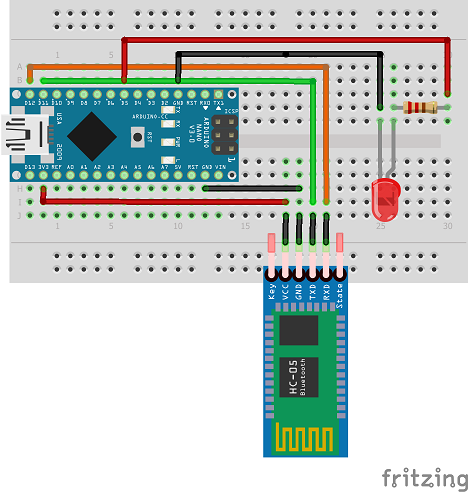
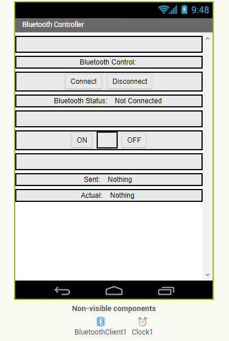
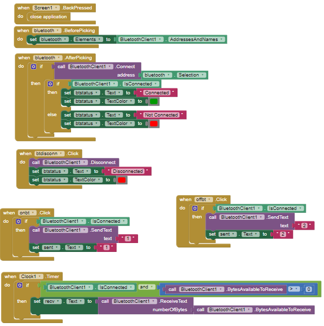

# ArduinoHC06-LED-fixed
Control LED using HC-06 Bluetooth Module and Arduino Micro Pro/Nano

Install the App.apk on your Android device
Wire up the Arduino to the HC-06 and LED
Upload the code to the Arduino - make sure all the pins are correct
Switch on the Arduino and run the App

NOTE: make sure that RX and TX (11, 12) are not connected while uploading your code otherwise an error may occur

# Wiring

# MIT App Inventor Code

